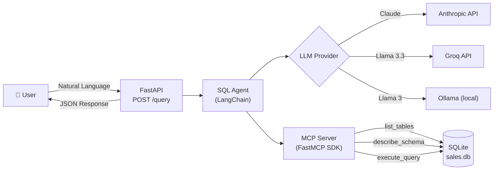

# AI Sales Query Agent

A FastAPI service that translates natural language questions into SQL queries against a SQLite database. Uses the **Model Context Protocol (MCP)** for secure data access and **LangChain** for AI-driven SQL generation.

## Architecture



### How It Works

1. **User** sends a natural language question via `POST /query`
2. **SQL Agent** gathers database schema context using MCP server tools
3. **LLM** generates a SQL query from the question + schema context
4. **MCP Server** executes the query with read-only enforcement
5. **API** returns the SQL, results, and chart-friendly data

## Tech Stack

| Component | Technology |
|-----------|-----------|
| API Framework | FastAPI |
| MCP Server | FastMCP SDK (`mcp` package) |
| AI Orchestration | LangChain |
| LLM Providers | Anthropic Claude / Groq / Ollama |
| Database | SQLite |
| Package Manager | uv |
| Containerization | Docker + Docker Compose |
| CI/CD | GitHub Actions |
| Testing | pytest |

## Quick Start

### Prerequisites

- [uv](https://docs.astral.sh/uv/) (Python package manager)
- [Docker](https://www.docker.com/) (for containerized deployment)
- One of: Anthropic API key, Groq API key, or [Ollama](https://ollama.ai/) running locally

### 1. Clone & Install

```bash
git clone https://github.com/AkhileshMalthi/AI-sales-query-agent.git
cd AI-sales-query-agent

# Install dependencies
uv sync --all-extras
```

### 2. Configure Environment

```bash
cp .env.example .env
# Edit .env and set your API key:
#   ANTHROPIC_API_KEY=sk-ant-...   (paid)
#   GROQ_API_KEY=gsk_...          (free tier available)
```

### 3. Seed the Database

```bash
uv run python scripts/setup_sales_db.py
```

### 4. Run Locally

```bash
uv run uvicorn app.main:app --reload --port 8000
```

### 5. Or Run with Docker

```bash
docker-compose up --build -d
```

The API will be available at **http://localhost:8000**. Interactive docs at **http://localhost:8000/docs**.

## API Usage

### `POST /query`

Translate a natural language question into SQL and get results.

**Request:**

```bash
curl -s -X POST http://localhost:8000/query \
  -H "Content-Type: application/json" \
  -d '{"question": "What is the total number of customers?"}'
```

**Response:**

```json
{
  "sql": "SELECT COUNT(*) AS total_customers FROM customers",
  "results": [{"total_customers": 500}],
  "chart_data": {
    "labels": ["total_customers"],
    "values": [500.0]
  }
}
```

### Example Queries

| Question | Description |
|----------|-------------|
| "Top 3 customers by order count" | Ranking with JOIN |
| "Average order value by region" | Aggregation by group |
| "Monthly revenue for 2024" | Time-series analysis |
| "Products that have never been ordered" | LEFT JOIN with NULL check |
| "Total spend by customer segment" | Segment analysis |
| "Total revenue from the Technology category" | Multi-table JOIN with filter |

## Database Schema

```
customers (id, name, region, segment)
orders (id, customer_id, amount, order_date)
products (id, name, category, price)
order_items (order_id, product_id, quantity)
```

- **500** customers across 4 regions and 3 segments
- **~50** products in Technology, Furniture, and Office Supplies
- **1500** orders throughout 2024
- **~4500** order line items

## MCP Server

The MCP server uses the official **FastMCP SDK** and exposes three tools:

| Tool | Description | Security |
|------|-------------|----------|
| `list_tables()` | Returns all table names | Read-only |
| `describe_schema(table_name)` | Returns column names & types | Validates table existence |
| `execute_query(sql)` | Executes SQL query | **SELECT-only**, rejects dangerous keywords |

### Security Measures

- Only `SELECT` statements are allowed
- Dangerous keywords (`DROP`, `DELETE`, `INSERT`, `UPDATE`, `ALTER`, etc.) are rejected
- SQLite `PRAGMA query_only = ON` as defense-in-depth
- Table name validation against `sqlite_master`

## LLM Provider Fallback

The agent supports multiple LLM providers with automatic fallback:

```
ANTHROPIC_API_KEY set? → Claude (claude-sonnet-4-20250514)
GROQ_API_KEY set?     → Groq (llama-3.3-70b-versatile) — free tier!
Ollama running?       → Ollama (llama3) — fully local
None available?       → RuntimeError with setup instructions
```

## Testing

```bash
# Run all tests (mocked LLM — no API key needed)
uv run pytest tests/ -v

# Lint check
uv run ruff check .
```

## End-to-End Evaluation

With the API running:

```bash
bash evaluator.sh
```

This runs 5 predefined queries and checks that all return non-empty results.

## Project Structure

```
.
├── main.py                  # FastAPI application
├── mcp_server.py            # MCP server (FastMCP SDK)
├── agent/
│   ├── __init__.py
│   ├── llm.py               # LLM provider abstraction
│   └── sql_agent.py          # SQL generation agent
├── data/
│   └── sales.db             # SQLite database
├── scripts/
│   └── setup_sales_db.py    # Database seeding script
├── tests/
│   ├── __init__.py
│   └── test_query.py        # pytest test suite
├── Dockerfile               # Container image (uv-based)
├── docker-compose.yml        # Service orchestration
├── evaluator.sh             # E2E evaluation script
├── pyproject.toml            # Project config & dependencies
├── requirements.txt          # pip-compatible deps (auto-generated)
├── .env.example              # Environment variable template
├── .github/workflows/ci.yml  # GitHub Actions CI
└── README.md
```

## License

[MIT](LICENSE)
